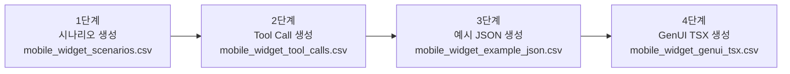

# GenUI Dataset Pipeline

Generative UI 모바일 위젯 시나리오 데이터를 **4단계 파이프라인**으로 생성하고 CSV로 누적 저장하는 스크립트 모음입니다.

## 한눈에 보는 전체 흐름 🧭

> 현재 4단계 구조를 기준으로, 전체 흐름을 빠르게 파악할 수 있게 요약했습니다 🙂



### 단계별 입력/출력 요약

| 단계 | 스크립트 | 입력 | 출력 |
|---|---|---|---|
| 1 | `generate_mobile_widget_scenarios.py` | 카테고리 목록, 모델 | `mobile_widget_scenarios.csv` |
| 2 | `generate_widget_tool_calls.py` | 1단계 CSV | `mobile_widget_tool_calls.csv` |
| 3 | `generate_widget_example_json.py` | 1단계 + 2단계 CSV | `mobile_widget_example_json.csv` |
| 4 | `generate_genui_tsx.py` | 3단계 CSV | `mobile_widget_genui_tsx.csv` |

> 용어 표준: `tool_call`(단수) / `tool_calls`(복수)를 표준 용어로 사용합니다.

---

## 빠른 실행 (전체 파이프라인) ⚡

### 요구 사항

- Python 3.10+
- `openai` 패키지

```bash
pip install openai
```

### 환경변수 설정(선택)

```bash
export VLLM_BASE_URL="http://localhost:8000/v1"
export VLLM_MODEL="Qwen/Qwen2.5-7B-Instruct"
export VLLM_API_KEY="EMPTY"
```

### 순차 실행 예시

```bash
# 1단계
python generate_mobile_widget_scenarios.py

# 2단계
python generate_widget_tool_calls.py

# 3단계
python generate_widget_example_json.py

# 4단계
python generate_genui_tsx.py
```

---

## 자세한 사용법 (클릭해서 펼치기) 📘

### 1단계: 시나리오 생성 🧩

<details>
<summary><strong>자세히 보기</strong></summary>

`generate_mobile_widget_scenarios.py`는 vLLM(OpenAI 호환 API)로 카테고리별 시나리오를 생성합니다.

#### 주요 동작

- 카테고리별로 시나리오 생성 요청
- 모델 응답 1회당 기본 5개 시나리오 생성
- 카테고리별 기존 시나리오 수를 확인해 `target` 미만일 때만 **부족분만 추가 생성**
- 예시 목록/기존 시나리오와 중복되지 않도록 프롬프트 제약 + 후처리 필터링
- 추상적 주제(예: `hotel reservation`) 대신 화면/의도 단위의 구체 시나리오를 유도
  - 예: `hotel search results`, `hotel room comparison`, `hotel booking payment`, `hotel booking confirmation`
- CSV 저장 컬럼
  - `created_at`
  - `model`
  - `prompt`
  - `category`
  - `scenario`

#### 실행 방법

기본 실행:

```bash
python generate_mobile_widget_scenarios.py \
  --base-url http://localhost:8000/v1 \
  --model Qwen/Qwen2.5-7B-Instruct \
  --csv-path mobile_widget_scenarios.csv
```

카테고리 직접 지정:

```bash
python generate_mobile_widget_scenarios.py --categories 쇼핑 음악 미디어 캘린더 여행 요리 운동
```

#### 옵션

- `--csv-path`: 출력 CSV 경로 (기본: `mobile_widget_scenarios.csv`)
- `--base-url`: vLLM OpenAI 호환 API URL (기본: `http://localhost:8000/v1`)
- `--api-key`: API 키 (기본: `VLLM_API_KEY` 또는 `EMPTY`)
- `--model`: 생성 모델명
- `--temperature`: 샘플링 온도 (기본: `0.8`)
- `--responses-per-category`: 카테고리별 모델 호출 횟수 (기본: `1`)
- `--scenarios-per-response`: 모델 응답 1회당 목표 시나리오 개수 (기본: `5`)
- `--target-per-category`: 카테고리별 최종 목표 시나리오 수 (기본: `responses-per-category * scenarios-per-response`)
- `--categories`: 생성 대상 카테고리 목록
- `--max-examples`: 프롬프트에 넣는 예시 개수 (기본: `5`)
- `--max-disallow`: 프롬프트에 넣는 기존 금지 시나리오 개수 (기본: `5`)

#### 출력 예시

- `[PROGRESS] 쇼핑: existing 3 / target 5`
- `[DONE] 쇼핑: accepted 2 / needed 2 (target 5)`
- `Saved 54 rows to mobile_widget_scenarios.csv`

#### 참고

- 스크립트는 CSV의 `category`+`scenario`를 읽어 카테고리별 누적 개수를 계산하고, `target`까지의 부족분만 생성합니다.
- 모델 출력 품질에 따라 실제 저장 개수는 요청 개수보다 적을 수 있습니다(중복/금지어 필터링).

</details>

---

## 스키마 체크리스트 (tool_call) ✅

- [ ] 2단계 출력 CSV 헤더가 `tool_call`인지 확인 .
- [ ] 2단계 산출물이 `tool_call` 헤더를 사용하는지 확인.
- [ ] 3단계 출력 CSV 헤더가 `tool_calls`인지 확인 .
- [ ] 샘플 데이터/테스트 fixture에서 `tool_call`/`tool_calls` 표준 헤더 사용 여부를 점검.
- [ ] 후속 소비 스크립트 `generate_genui_tsx.py`는 `example_json` 내부의 `actions`만 사용하므로 3단계 컬럼명 변경 영향이 없는지 smoke test로 확인.
- [ ] 용어 표준(`tool_call`, `tool_calls`)이 문서/스크립트에 일관되게 사용되는지 `rg`로 점검.

### 2단계: Tool Call 생성 🛠️

<details>
<summary><strong>자세히 보기</strong></summary>

`generate_widget_tool_calls.py`는 1단계에서 만든 시나리오 CSV를 읽고, 시나리오별 tool call을 생성해 별도 CSV에 누적 저장합니다.

#### 주요 동작

- 입력: `mobile_widget_scenarios.csv` (기본)
- 시나리오 1개당 최대 3개 tool call 생성(기본)
- tool call 포맷: `function_name(param1=value1, param2=value2, ...) - short description`
- `params` 같은 플레이스홀더 대신 시나리오에 맞는 실제 파라미터/값을 채워 생성
- 기존 tool call 중복이 있어도, 생성 일자/모델/시나리오가 다르면 그대로 추가
- 프롬프트 예시 개수는 `--max-examples`로 조절 가능
- CSV 저장 컬럼
  - `created_at`
  - `model`
  - `scenario_created_at`
  - `scenario_model`
  - `category`
  - `scenario`
  - `prompt`
  - `tool_call`

#### 실행 방법

```bash
python generate_widget_tool_calls.py \
  --base-url http://localhost:8000/v1 \
  --model Qwen/Qwen2.5-7B-Instruct \
  --scenario-csv mobile_widget_scenarios.csv \
  --tool-call-csv mobile_widget_tool_calls.csv
```

#### 옵션

- `--scenario-csv`: 1단계 시나리오 CSV 경로 (기본: `mobile_widget_scenarios.csv`)
- `--tool-call-csv`: tool call 출력 CSV 경로 (기본: `mobile_widget_tool_calls.csv`)
- `--base-url`: vLLM OpenAI 호환 API URL
- `--api-key`: API 키
- `--model`: 생성 모델명
- `--temperature`: 샘플링 온도 (기본: `0.4`)
- `--max-items-per-scenario`: 시나리오당 최대 tool call 개수 (기본: `3`)
- `--max-examples`: 프롬프트 예시 개수 상한 (기본: `10`)
- `--limit-scenarios`: 앞에서 N개 시나리오만 테스트 생성 (기본: `0`, 전체)

</details>

### 3단계: 구체 예시 JSON 생성 🧪

<details>
<summary><strong>자세히 보기</strong></summary>

`generate_widget_example_json.py`는 1단계 시나리오 + 2단계 tool call을 조합해서, 4단계 JSX/HTML 생성 시 바로 참고할 수 있는 **구체 데이터 JSON** 예시를 생성합니다.

#### 주요 동작

- 입력:
  - `mobile_widget_scenarios.csv` (1단계)
  - `mobile_widget_tool_calls.csv` (2단계)
- 시나리오 1개당 여러 개의 구체 JSON variant 생성 (`--variants-per-scenario`, 기본 3)
- 내장된 10개 JSON 예시 풀에서 시나리오마다 무작위 일부를 선택해 프롬프트에 삽입 (`--max-examples`로 개수 조절)
- 각 JSON 객체에 `actions` 키를 강제 포함
  - tool call이 있으면 함수명만 추출해 `actions`에 반영
  - 필요 없으면 `actions: []`
- 같은 시나리오에서도 다양한 도메인 변형(예: 쇼핑에서 커피/의류/전자제품 등)을 유도
- CSV 저장 컬럼 (단일 파일 누적):
  - `created_at`
  - `model`
  - `scenario_created_at`
  - `scenario_model`
  - `category`
  - `scenario`
  - `prompt`
  - `tool_calls`
  - `variant_index`
  - `difficulty_target` (생성 시 variant index별 목표 난이도)
  - `difficulty` (`low|medium|high:score` 형식, 예: `medium:58`)
  - `example_json`

#### 3단계 난이도(`difficulty`) 산정 기준

`difficulty`는 JSON variant 단위로 계산되며, **모델이 4단계에서 UI를 만들 때의 복잡도**를 근사합니다.
또한 생성 시 기본적으로 같은 시나리오 내 variant들을 **같은 핵심 예시로 유지**한 뒤,
`difficulty_target`을 low→medium→high 순으로 부여해 난이도만 단계적으로 바뀌도록 유도합니다.

기본값은 **랜덤이 아니라 `rotate`(결정적 회전)** 입니다.
- 기본(`--difficulty-strategy rotate`): variant index 기준으로 low→medium→high를 반복
- 랜덤(`--difficulty-strategy random`): `--difficulty-seed` 기반으로 무작위 배치
- 고정(`--difficulty-strategy fixed`): `--difficulty-fixed-level` 하나로 통일

- `actions` 복잡도 (가중치 큼): 고유 tool call 개수가 많을수록 난이도 증가
- 필드 복잡도: `actions` 제외 top-level 필드 수가 많을수록 증가
- 구조 복잡도: 중첩 depth, 객체/배열 노드 수, 배열 원소 수가 많을수록 증가
- payload 복잡도: 문자열 총 길이가 길수록 증가
- 시나리오 복잡도: 시나리오 토큰 수가 많을수록 증가
- action 모호성 보정: raw tool call 대비 함수명 추출이 많이 줄어들면 소폭 가산

최종 score(0~100)를 기준으로 다음 레벨을 붙입니다.
- `low`: 0~33
- `medium`: 34~66
- `high`: 67~100

#### 실행 방법

```bash
python generate_widget_example_json.py \
  --base-url http://localhost:8000/v1 \
  --model Qwen/Qwen2.5-7B-Instruct \
  --scenario-csv mobile_widget_scenarios.csv \
  --tool-call-csv mobile_widget_tool_calls.csv \
  --json-csv mobile_widget_example_json.csv
```

#### 옵션

- `--scenario-csv`: 1단계 시나리오 CSV 경로 (기본: `mobile_widget_scenarios.csv`)
- `--tool-call-csv`: 2단계 tool call CSV 경로 (기본: `mobile_widget_tool_calls.csv`)
- `--json-csv`: 3단계 JSON 예시 CSV 경로 (기본: `mobile_widget_example_json.csv`)
- `--base-url`: vLLM OpenAI 호환 API URL
- `--api-key`: API 키
- `--model`: 생성 모델명
- `--temperature`: 샘플링 온도 (기본: `0.5`)
- `--variants-per-scenario`: 시나리오별 JSON variant 개수 (기본: `3`)
- `--max-examples`: 프롬프트에 넣을 무작위 JSON 예시 개수 (기본: `3`)
- `--example-seed`: 예시 샘플링 시드값 (기본: `42`)
- `--difficulty-strategy`: 난이도 target 배치 방식 `rotate|random|fixed` (기본: `rotate`)
- `--difficulty-fixed-level`: `fixed` 전략일 때 사용할 레벨 `low|medium|high` (기본: `medium`)
- `--difficulty-seed`: `random` 전략 난수 시드 (기본: `42`)
- `--limit-scenarios`: 앞에서 N개 시나리오만 테스트 생성 (기본: `0`, 전체)

</details>

### 4단계: GenUI TSX 생성 🎨

<details>
<summary><strong>자세히 보기</strong></summary>

`generate_genui_tsx.py`는 3단계 JSON(`example_json`)을 입력으로 받아, **component 의존성이 없는 최소 UI 형태의 TSX**를 생성합니다.

#### 주요 동작

- 입력: `mobile_widget_example_json.csv` (3단계)
- 각 JSON row마다 동일한 프롬프트로 여러 번 호출해 샘플 생성 (`--samples-per-input`)
  - 한 번의 호출에서는 TSX 1개만 생성
  - 같은 입력에 대해 여러 번 호출하여 다양한 정답 후보를 축적
- 출력은 SFT 용도로 바로 사용 가능하도록 `prompt` + `example_json` + `tsx_code` 저장
- RLVR 등 후속 방법론을 고려해 `rlvr_reward_spec`(체크 항목/가중치) 함께 저장
- CSV 저장 컬럼:
  - `created_at`
  - `model`
  - `json_created_at`
  - `json_model`
  - `scenario_created_at`
  - `scenario_model`
  - `category`
  - `scenario`
  - `json_variant_index`
  - `json_difficulty_target`
  - `json_difficulty`
  - `sample_index`
  - `prompt`
  - `example_json`
  - `tsx_code`
  - `format_ok`
  - `uses_declared_actions`
  - `rlvr_reward_spec`

#### 실행 방법

```bash
python generate_genui_tsx.py \
  --base-url http://localhost:8000/v1 \
  --model Qwen/Qwen2.5-7B-Instruct \
  --json-csv mobile_widget_example_json.csv \
  --tsx-csv mobile_widget_genui_tsx.csv
```

#### 옵션

- `--json-csv`: 3단계 JSON CSV 경로 (기본: `mobile_widget_example_json.csv`)
- `--tsx-csv`: 4단계 TSX 출력 CSV 경로 (기본: `mobile_widget_genui_tsx.csv`)
- `--base-url`: vLLM OpenAI 호환 API URL
- `--api-key`: API 키
- `--model`: 생성 모델명
- `--temperature`: 샘플링 온도 (기본: `0.3`)
- `--samples-per-input`: 입력 1개당 반복 생성 횟수 (기본: `3`)
- `--limit-rows`: 앞에서 N개 JSON row만 테스트 생성 (기본: `0`, 전체)

</details>
